# Online Examination System

## Overview

The **Online Examination System** is a web application that enables administrators to create exams, manage questions, and view results, while students can register, take exams, and view their scores. The project is built using Java, JSP, Servlets, and MySQL, with a focus on a clean architecture that separates concerns across different layers of the application.

## Table of Contents

- [Features](#features)
- [Screenshots](#screenshots)
- [Project Structure](#project-structure)
- [Technologies Used](#technologies-used)
- [Setup and Installation](#setup-and-installation)
- [How to Contribute](#how-to-contribute)
- [License](#license)
- [Contact](#contact)

## Features
1. Admin Features:
   - Create, update, and delete exams.
   - Manage questions for each exam.
   - View scores of all students.
2. Student Features:
   - Register and log in to the system.
   - View available exams and take exams.
   - View their scores after completing an exam.

## Screenshots
- Login Page <br>
  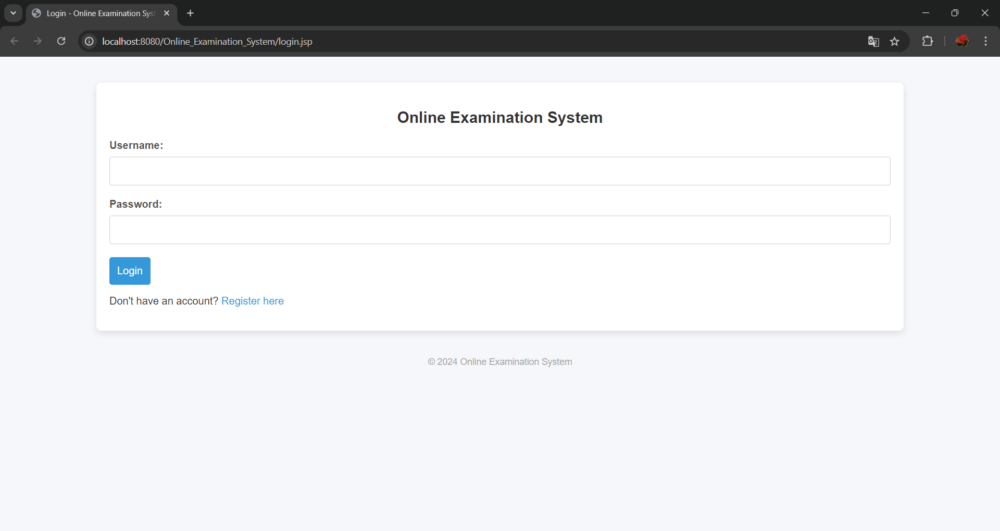
  <br>
  <br>
  
  <br>
  <br>
  
  <br>
  <br>
- Admin Registration <br>
  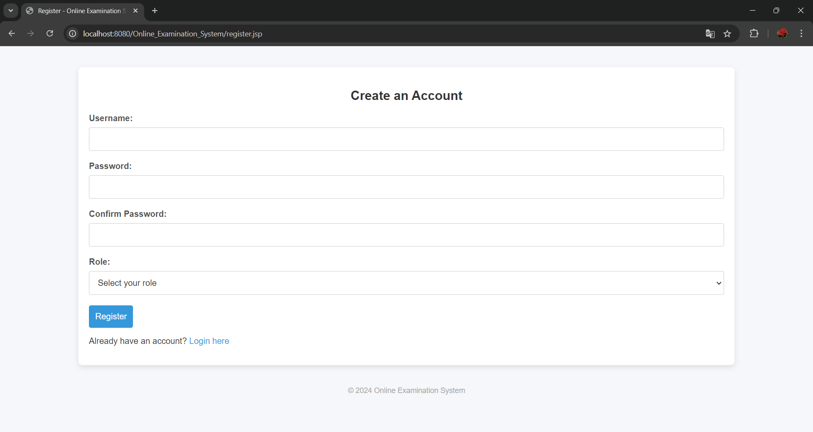
  <br>
  <br>
  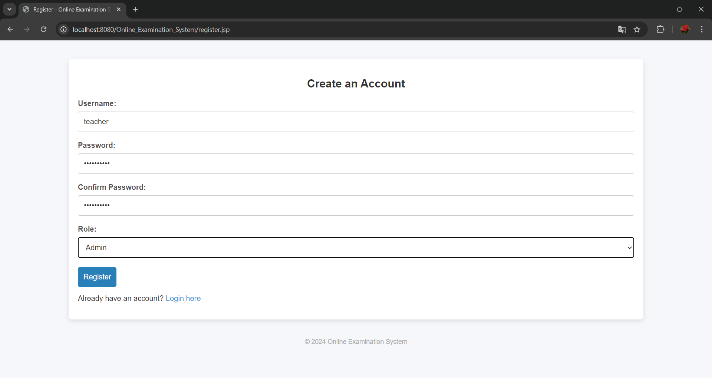
  <br>
  <br>
- Registration Successful <br>
  
  <br>
  <br>
- Admin Dashboard <br>
  
  <br>
  <br>
- Select Manage Exam <br>
  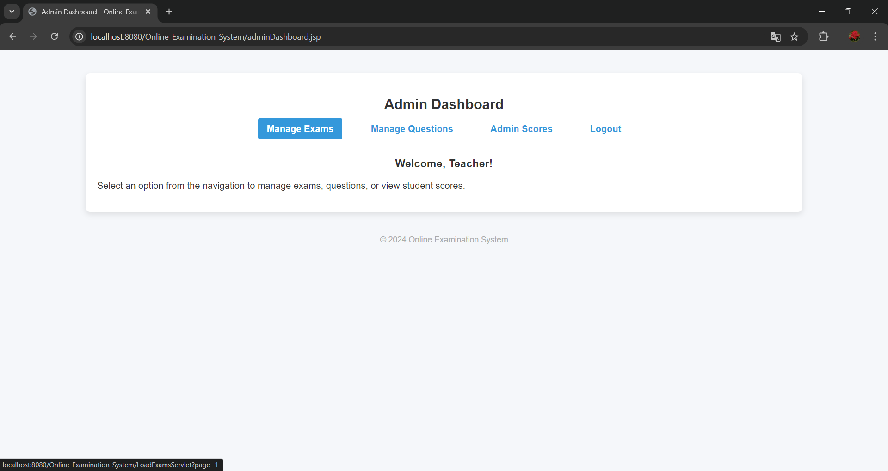
  <br>
  <br>
- Manage Exam <br>
  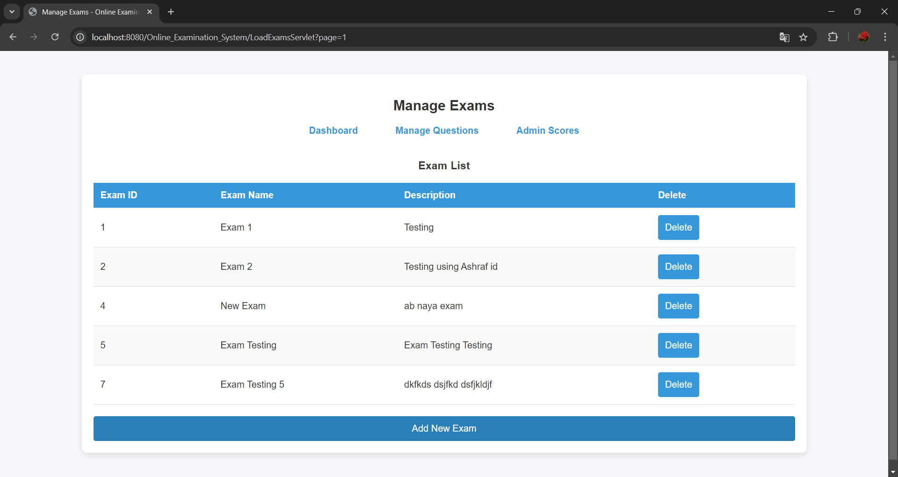
  <br>
  <br>
- Adding New Exam <br>
  
  <br>
  <br>
- New Exam Added Successfully Add Questions Now <br>
  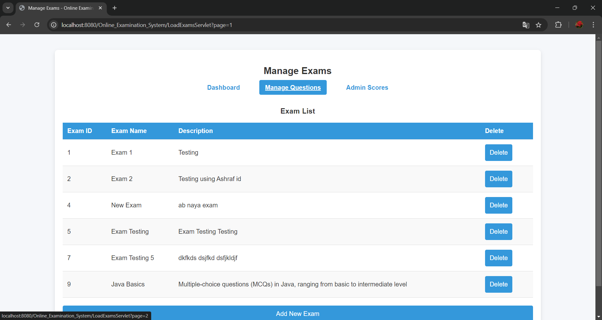
  <br>
  <br>
- Add New Question <br>
  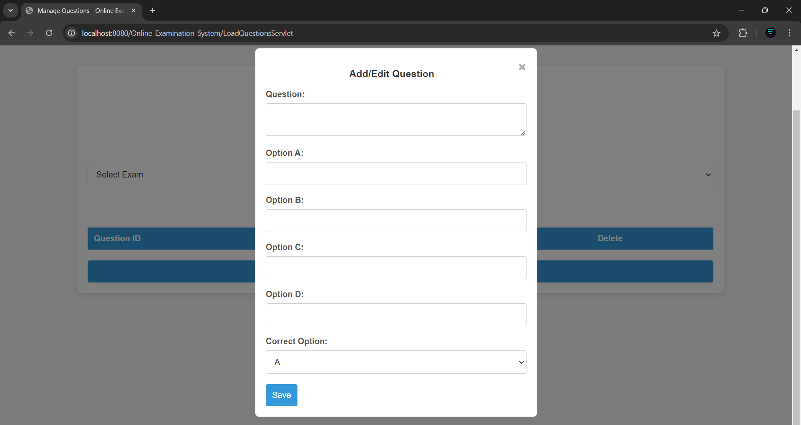
  <br>
  <br>
- Adding New Question <br>
  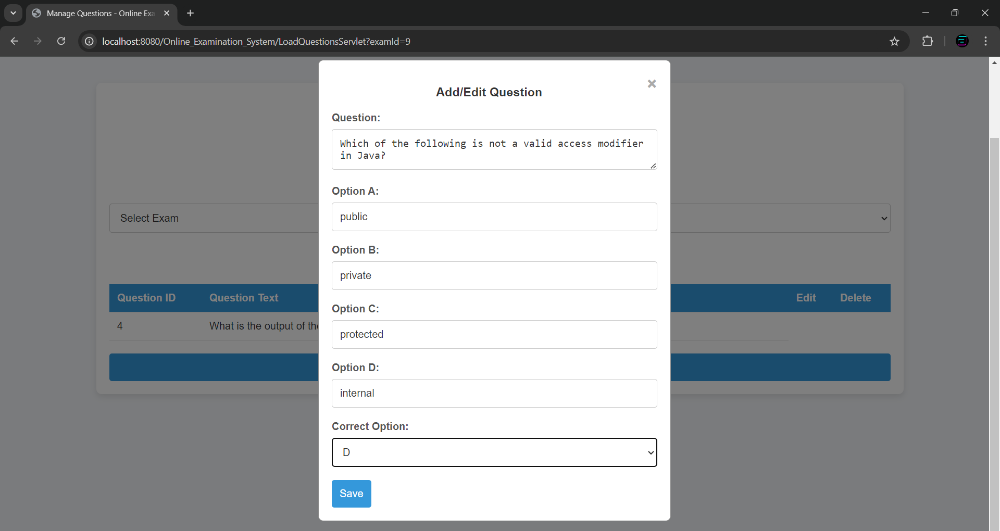
  <br>
  <br>
- Added All Questions <br>
  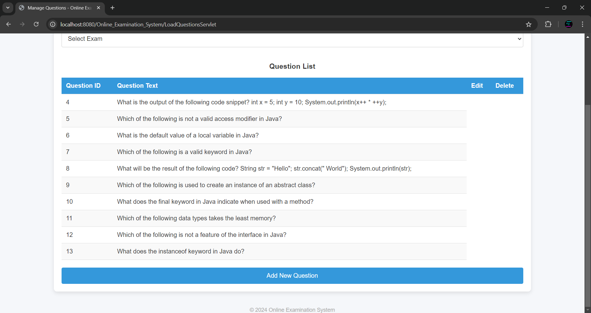
  <br>
  <br>
- Logout <br>
  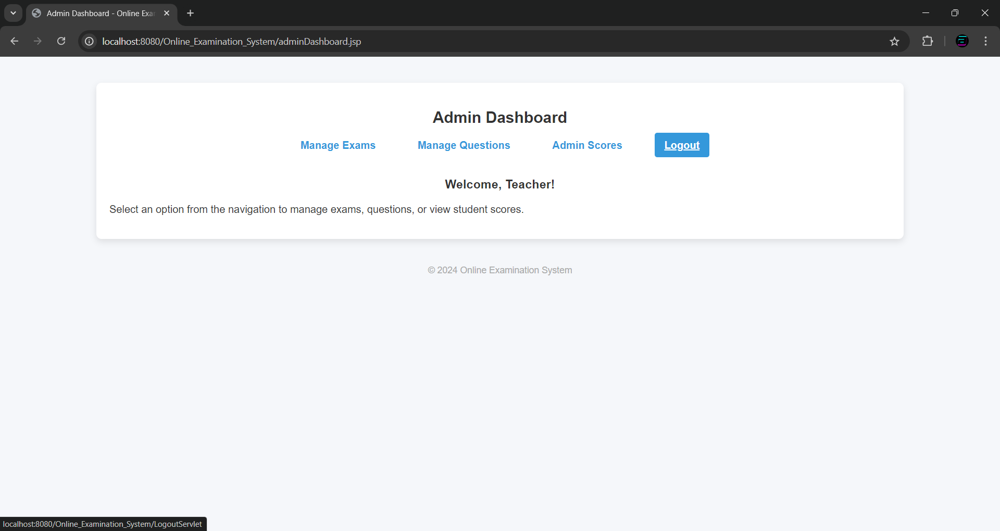
  <br>
  <br>
- Student Registration <br>
  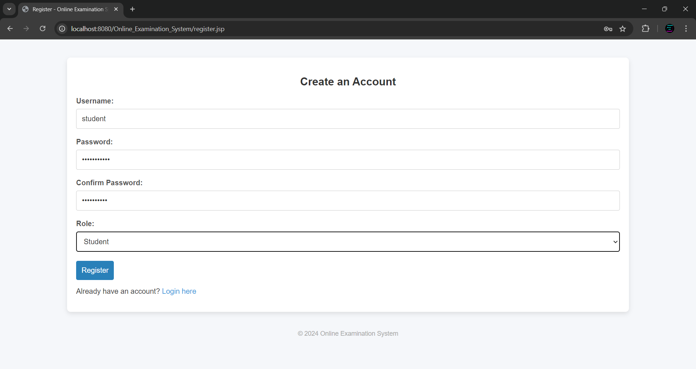
  <br>
  <br>
  
  <br>
  <br>
  
  <br>
  <br>
- Available Exams For Students <br>
  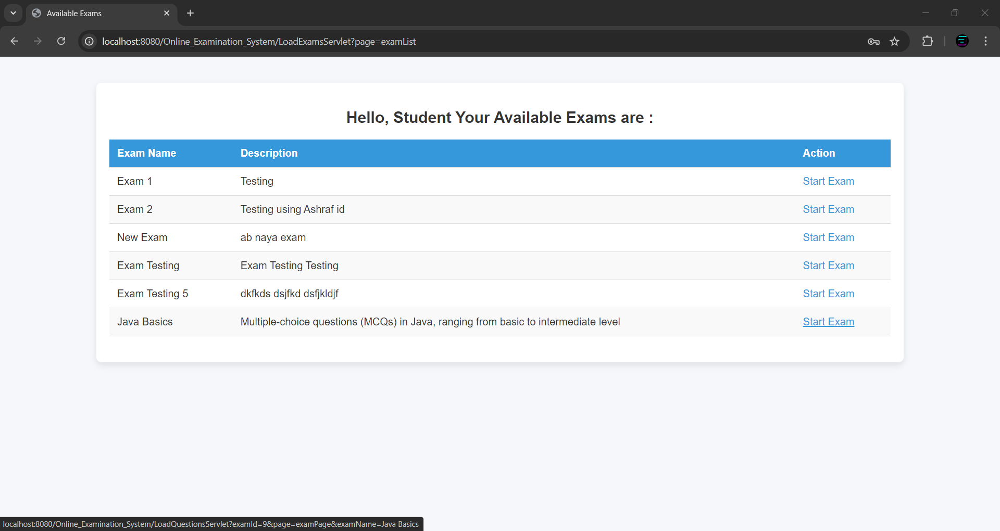
  <br>
  <br>
- Exam Page <br>
  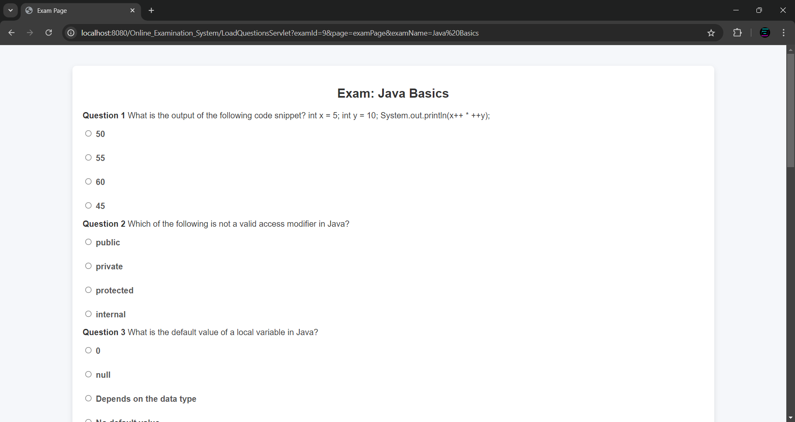
  <br>
  <br>
- Submitting the Exam <br>
  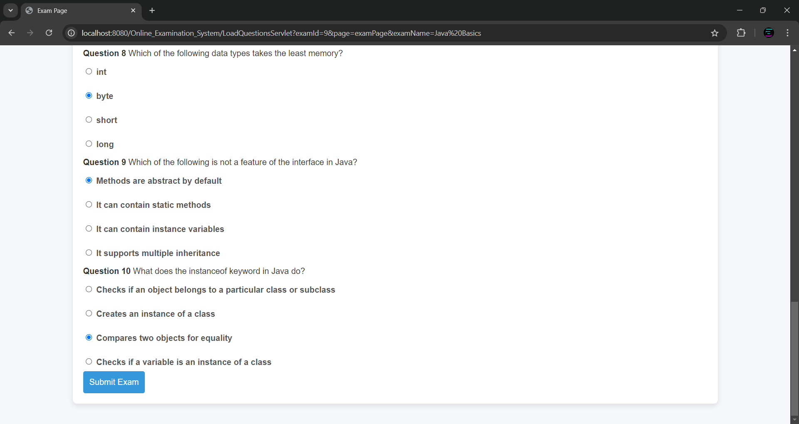
  <br>
  <br>
- Student's All Scores till date <br>
  
  <br>
  <br>
- Admin's Exam wise Scores Page <br>
  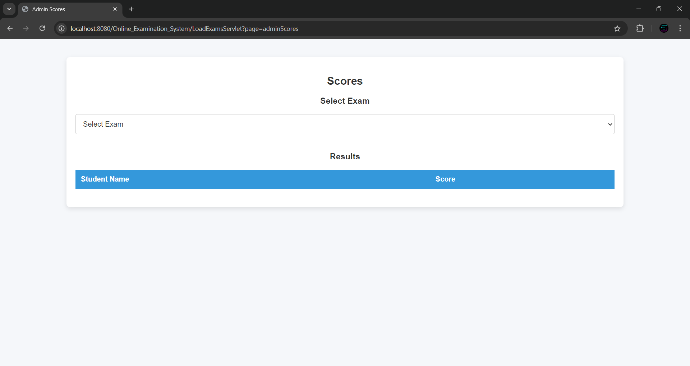
  <br>
  <br>
  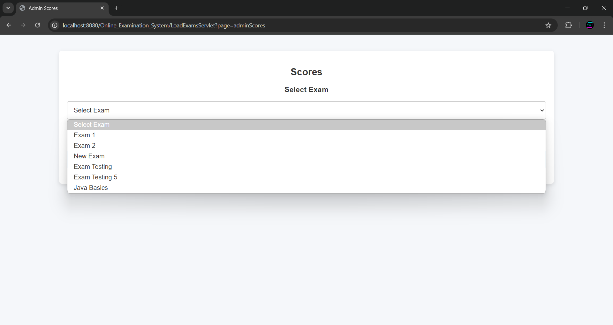
  <br>
  <br>
  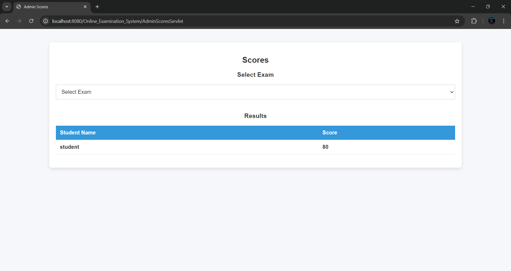
  <br>
  <br>
## Project Structure
```bash
OnlineExaminationSystem/
│
├── src/
│   ├── main/
│   │   ├── java/
│   │   │   ├── com.myapp.dao/
│   │   │   │   ├── ExamDao.java
│   │   │   │   ├── QuestionDao.java
│   │   │   │   ├── ResultDao.java
│   │   │   │   └── UserDao.java
│   │   │   ├── com.myapp.utils/
│   │   │   │   ├── DBConnection.java
│   │   │   │   ├── Exam.java
│   │   │   │   ├── ExamScore.java
│   │   │   │   ├── Question.java
│   │   │   │   ├── Result.java
│   │   │   │   ├── User.java
│   │   │   │   └── UserScore.java
│   │   │   ├── com.myapp.servlets/
│   │   │   │   ├── AdminScoresServlet.java
│   │   │   │   ├── AdminServlet.java
│   │   │   │   ├── LoadExamsServlet.java
│   │   │   │   ├── LoadQuestionsServlet.java
│   │   │   │   ├── LoginServlet.java
│   │   │   │   ├── LogoutServlet.java
│   │   │   │   ├── QuestionServlet.java
│   │   │   │   ├── RegisterServlet.java
│   │   │   │   └── SubmitExamServlet.java
│   │   └── webapp/
│   │       ├── WEB-INF/
│   │       │   ├── lib
│   │       │   │   └── mysql-connector-j-8.4.0.jar
│   │       │   └── web.xml
│   │       ├── adminDashboard.jsp
│   │       ├── adminScores.jsp
│   │       ├── examList.jsp
│   │       ├── examPage.jsp
│   │       ├── login.jsp
│   │       ├── manageExams.jsp
│   │       ├── manageQuestions.jsp
│   │       ├── register.jsp
│   │       ├── resultPage.jsp
│   │       ├── viewScores.jsp
│   │       └── style.css
│   └── README.md
```


## Technologies Used

- **Java**: Core programming language.
- **JSP (JavaServer Pages)**: For building the user interface.
- **Servlets**: For handling HTTP requests and business logic.
- **MySQL**: For database management.
- **HTML/CSS/JavaScript**: For front-end development.

## Setup and Installation

### Prerequisites

- **Java Development Kit (JDK)**
- **Apache Tomcat** (or any other servlet container)
- **MySQL** (or any other relational database)

### Installation Steps

1. **Clone the repository:**

   ```bash
   git clone https://github.com/arshadpatel/online-exam-app.git
2. **Import the project into your IDE** (e.g., IntelliJ IDEA, Eclipse).

3. **Set up the MySQL Database:**

   - Create a new database called `onlineexamapp`.
   - Run the SQL scripts located to create tables and populate initial data if required.

   ```bash
   CREATE DATABASE onlineexamapp;

   CREATE TABLE users (
       user_id INT PRIMARY KEY AUTO_INCREMENT,
       username VARCHAR(50) NOT NULL UNIQUE,
       password VARCHAR(50) NOT NULL,
       role VARCHAR(20) NOT NULL
   );

   CREATE TABLE exams (
       exam_id INT PRIMARY KEY AUTO_INCREMENT,
       exam_name VARCHAR(100) NOT NULL,
       description TEXT
   );

   CREATE TABLE questions (
       question_id INT PRIMARY KEY AUTO_INCREMENT,
       examId INT,
       question TEXT NOT NULL,
       optionA VARCHAR(100) NOT NULL,
       optionB VARCHAR(100) NOT NULL,
       optionC VARCHAR(100) NOT NULL,
       optionD VARCHAR(100) NOT NULL,
       correctOption VARCHAR(10) NOT NULL,
       FOREIGN KEY (examId) REFERENCES exams(exam_id) ON DELETE CASCADE
   );

   CREATE TABLE results (
       result_id INT PRIMARY KEY AUTO_INCREMENT,
       user_id INT,
       exam_id INT,
       score INT NOT NULL,
       FOREIGN KEY (user_id) REFERENCES users(user_id),
       FOREIGN KEY (exam_id) REFERENCES exams(exam_id)
   );
   ```
4. **Configure Database Connection:**

   - Open DBConnection.java located in `src/main/java/com/myapp/utils/`.
   - Update the database URL, username, and password as per your MySQL configuration.

5. **Deploy the application:**

   - Deploy the project on Apache Tomcat by placing the WAR file (if built) or the project directory in the webapps folder of Tomcat.
   - Start the Tomcat server.

6. **Access the application:**

   - Open your web browser and navigate to `http://localhost:8080/OnlineExaminationSystem.`

## **How to Contribute**

  Contributions are highly appreciated! Before you start, please check the [Issues](https://github.com/arshadpatel/online-exam-app/issues) section of this repository.

1. **Visit the Issues Section**: 
   - Check the existing issues to see if there's anything you'd like to work on.
   - If you find an issue you'd like to tackle, comment on it to let others know you're working on it.

2. **Create a New Issue**: 
   - If you have a new feature or improvement idea that is not listed in the issues, create a new issue first.
   - Provide a clear description and the purpose of your proposed changes.
3.  **Fork the repository.**
4. **Create a new branch for your feature or bugfix**
   ```bash
   git checkout -b feature-name
   ```
5. **Make your changes in the code** 
6. **Commit your changes:**
     ```bash
     git commit -m "Description of the feature or fix"
      ```
7. **Push to your branch:**
     ```bash
     git push origin feature-name
     ```
8. **Create a Pull Request on GitHub.**
#### Code Style Guidelines
- Follow Java naming conventions.
- Ensure that your code is properly formatted.
- Comment your code where necessary.

## License

If you wish to use, modify, or contribute to this project, please get in touch with the repository owner for further details.

## Contact

For any queries, discussions, or suggestions, feel free to:

- **Open an issue on GitHub**: If you encounter any bugs, have feature requests, or want to discuss anything related to the project.
- **Reach out via LinkedIn**: You can contact the repository owner directly at [LinkedIn](https://www.linkedin.com/in/arshad-patel/) for more direct communication.

I welcome contributions from developers of all skill levels. Let's work together to make this project even better!
